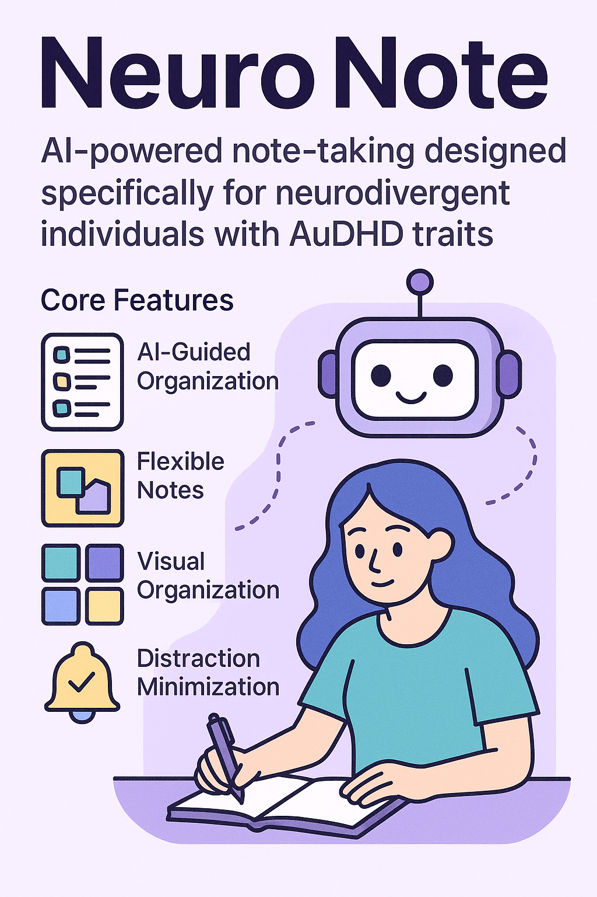

# NeuroProject Manager

AI-powered project management designed specifically for neurodivergent entrepreneurs with AuDHD traits.

## Overview

NeuroProject Manager is a specialized project management tool that addresses the unique challenges faced by individuals with AuDHD traits. It leverages AI to break down complex projects into manageable tasks, provide supportive reminders, and offer accommodations tailored to neurodivergent thinking styles.

### Core Features

- **AI-Powered Task Breakdown**: Transforms vague project ideas into clear, actionable tasks
- **Visual Task Management**: Optimized interface for attention and executive function management
- **Resource Planning**: AI suggestions for team members, tools, and budgeting
- **Risk Analysis**: Proactive identification of potential issues with mitigation strategies
- **Supportive Reminders**: Contextual prompts designed for AuDHD traits
- **Progress Tracking**: Visual representations of project status

## Getting Started

### Prerequisites

- Python 3.8+
- OpenAI API key

### Installation

1. Clone this repository:
   ```bash
   git clone https://github.com/yourusername/neuroproject-manager.git
   cd neuroproject-manager
   ```

2. Create and activate a virtual environment:
   ```bash
   python -m venv venv
   source venv/bin/activate  # On Windows: venv\Scripts\activate
   ```

3. Install dependencies:
   ```bash
   pip install -r requirements.txt
   ```

4. Create a `.env` file with your OpenAI API key:
   ```
   OPENAI_API_KEY=your_api_key_here
   ```

### Usage

#### Command Line Interface

Run the CLI tool for quick project breakdown:

```bash
python project_cli.py
```

#### Web Interface

1. Start the FastAPI backend:
   ```bash
   uvicorn api:app --reload
   ```

2. In a new terminal, start the Streamlit frontend:
   ```bash
   streamlit run streamlit_app.py
   ```

3. Open your browser and go to http://localhost:8501

## Project Structure

```
neuroproject-manager/
├── project_cli.py          # Command line interface
├── api.py                  # FastAPI backend 
├── streamlit_app.py        # Streamlit frontend
├── requirements.txt        # Dependencies
├── README.md               # Documentation
└── .env                    # Environment variables (add to .gitignore)
```

## Dependencies

Create a `requirements.txt` file with these dependencies:

```
fastapi
uvicorn
streamlit
openai
python-dotenv
pandas
altair
requests
```

## AuDHD-Specific Design Considerations

This tool incorporates several design considerations for neurodivergent users:

1. **Task Decomposition**: Breaking large projects into smaller, more manageable pieces
2. **Visual Organization**: Color-coding by priority and status
3. **Clear Starting Points**: Each task includes specific first steps to overcome activation barriers
4. **Reduced Cognitive Load**: Interface minimizes distractions and unnecessary choices
5. **Supportive Language**: Non-judgmental, encouraging reminders
6. **Progress Visualization**: Clear visual feedback on achievements

## Future Enhancements

- Calendar integration for time management
- Spaced repetition reminders for task follow-through
- Mobile app with notification management designed for ADHD
- Community templates for common project types
- Data persistence with proper database integration
- User authentication and project sharing

## Contributing

Contributions are welcome! Please feel free to submit a Pull Request.

## License

This project is licensed under the MIT License - see the LICENSE file for details.
